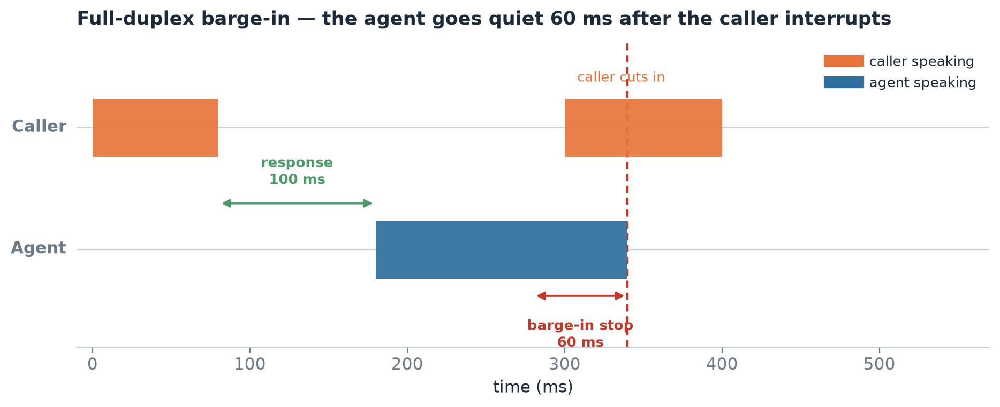
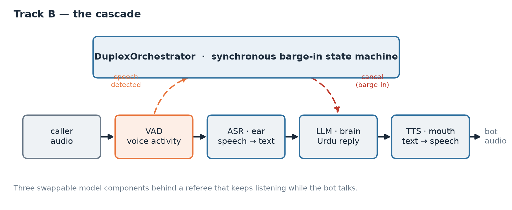
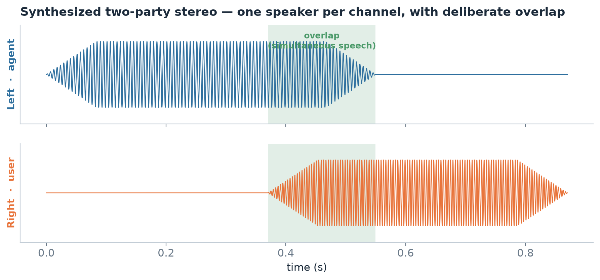

<div align="center">

# duplex-bol

**A full-duplex Pakistani-Urdu speech-to-speech calling agent — built as a one-week proof of concept.**

*bol* (بول) — Urdu for *"speak"*.

[](https://github.com/maidah-binte-tariq/duplex-bol/actions/workflows/ci.yml)
[](https://www.python.org/)
[](LICENSE)
[](http://mypy-lang.org/)
[](https://github.com/astral-sh/ruff)

</div>

---

## The problem

Most voice bots are walkie-talkies. You talk, they wait, they think, they reply. The
moment you try to interrupt — "no, not that one" — they keep talking over you,
because they stopped listening the instant they started speaking.

A real phone conversation is **full-duplex**: both sides can talk at once, and either
can cut in mid-sentence. This repo is a one-week POC for a calling agent that talks
in natural Pakistani Urdu *and* handles interruption the way a person does.

The honest constraint, stated up front: a fully fluent end-to-end Urdu full-duplex
model in one week is not realistic (the base models were trained on 1,000+ GPUs and
there is no two-party Urdu phone audio to fine-tune on). So this is built as **two
tracks run in parallel** — one safe, one ambitious — and judged on testable
hypotheses, not vibes.

| | Track B — the cascade *(safe)* | Track A — Moshi *(ambitious)* |
|---|---|---|
| **Idea** | Chain streaming ASR → LLM → TTS, add a referee that watches the mic | Adapt a genuinely full-duplex model (Moshi) toward Urdu |
| **Full-duplex how** | Fast barge-in (VAD cancels the bot in ~60 ms) | True simultaneous listen-and-speak |
| **Runs on** | Free Kaggle / a single 16 GB GPU | A rented 24 GB+ GPU (A100) |
| **Gives you** | A working Urdu call by Friday | Proof the real full-duplex path is viable |
| **Status here** | Orchestrator + eval implemented & tested | Data synthesis + tokenizer swap + config implemented & tested |

> This repository is the **engineering scaffold** for that POC: the data engineering,
> the barge-in orchestration, the evaluation harness, and the Track-A fine-tuning
> setup — all typed, tested, and runnable on a laptop. The model weights and GPU runs
> live in the [notebooks](notebooks/).

---

## See it work in 30 seconds

```bash
make setup        # uv venv + editable install + pre-commit
make demo         # run the cascade end-to-end, no GPU, no microphone
```

```text
  [  0] CaptureStarted
  [  0] PartialTranscript
  [  8] UserUtterance          # caller finished: "السلام علیکم"
  [  8] AgentReply
  [  9] SpeechStarted          # bot starts talking...
  [ 11] BargeIn  <-- interrupted   # ...caller cuts in; bot goes quiet
  [ 11] CaptureStarted         # and we're listening again

latency budget (H4 barge-in <= 500ms, H5 response <= 1000ms):
metric                 p95(ms)   budget(ms)   status
barge_in_stop             60.0       500.0   PASS
response_start           120.0      1000.0   PASS

overall: PASS
```

That trace is produced by a real state machine driving fake-but-deterministic
components. Swap the fakes for Whisper / an LLM / an Urdu TTS and the same policy
drives a live call. The timeline below is rendered **directly from those events**
(`scripts/make_figures.py`) — the 60 ms stop is measured, not drawn:

<p align="center"></p>

---

## How it fits together

<p align="center"></p>

The interesting part is the **orchestrator**: an inherently async, real-time problem
(keep listening while speaking; stop fast when interrupted) refactored into a
*pure, synchronous, frame-driven state machine*. That is what makes the barge-in
behavior unit-testable without a GPU or audio hardware — see
[`docs/architecture.md`](docs/architecture.md).

For Track A, the load-bearing trick is **manufacturing two-party Urdu audio that
doesn't exist**: take single-speaker clips, put one speaker on the left channel and
another on the right with a touch of overlap, and you have the stereo
conversation format Moshi trains on. That's
[`duplex_bol.data.build_dialogue`](src/duplex_bol/data/stereo_dialogue.py), and the
[data-engineering doc](docs/data-engineering.md) explains it from scratch.

<p align="center"></p>

---

## What's actually in here

```
duplex-bol/
├── src/duplex_bol/
│   ├── text/          # Urdu (Nastaliq) normalization — folds Arabic<->Urdu, keeps ZWNJ
│   ├── audio/         # WAV I/O + resample/mono/stereo (stdlib `wave`, no ffmpeg needed)
│   ├── data/          # manifests, Common Voice speaker selection, two-party stereo synth
│   ├── cascade/       # Track B: component Protocols, energy VAD, the barge-in orchestrator
│   ├── moshi/         # Track A: Urdu SentencePiece tokenizer swap + LoRA config
│   ├── eval/          # WER/CER (with Urdu normalization) + the H4/H5 latency budget
│   └── cli.py         # `duplex-bol {text,data,eval,moshi,demo}`
├── tests/             # 100+ tests; the orchestrator, stereo synth, and WER are the core
├── notebooks/         # Kaggle fine-tuning notebooks for both tracks
├── configs/           # cascade.yaml + a round-trippable moshi_lora.yaml
├── docs/              # architecture, data engineering, the feasibility report, ADRs
└── scripts/           # make_demo_corpus.py — builds a real tiny corpus offline
```

A few things that show up across the codebase and are deliberate:

- **The Urdu normalizer preserves ZWNJ and the hamza letters (ؤ ئ ء).** Those are
  *content* in Urdu; the common off-the-shelf bug is stripping them. Codepoints are
  written as explicit `\uXXXX` escapes so a reviewer can check them.
- **WER is scored on normalized text.** Otherwise ARABIC YEH vs FARSI YEH counts as
  an error on every word with a yeh, and your numbers lie.
- **Manifests are validated before any GPU is touched** — a malformed row should
  cost you ten seconds, not three minutes into a fine-tune.

---

## Using it

```bash
# Normalize Urdu (folds Arabic yeh/kaf/heh, strips diacritics, keeps ZWNJ)
duplex-bol text normalize "کيا حال هے"          # -> کیا حال ہے

# Score an ASR hypothesis against a reference (normalized, so it's fair)
duplex-bol eval wer --ref "آپ کیسے ہیں" --hyp "آپ کیسے ہو"

# Pick 3 gender-mixed speakers out of a Common Voice TSV
duplex-bol data select-speakers --tsv validated.tsv --n 3

# Sanity-check a Moshi config's VRAM before renting a GPU
duplex-bol moshi vram --config configs/moshi_lora.yaml
```

Build a tiny end-to-end corpus offline (real WAVs + valid manifests, no downloads):

```bash
make demo-corpus      # writes data/demo/{trackA,trackB}/...
```

---

## Development

```bash
make check     # ruff + mypy --strict + pytest (this is the CI gate)
make test      # tests with coverage
```

The bar: everything is typed (`mypy --strict`, no ignores in the core) and tested
without a GPU. See [CONTRIBUTING.md](CONTRIBUTING.md).

---

## Honest limitations

- The cascade's "full-duplex" is fast barge-in, not true simultaneity. It *feels*
  full-duplex; Moshi *is* full-duplex. Both are here on purpose.
- The Track-A corpus is synthesized two-party audio. It proves the pipeline and the
  tokenizer swap; it will not produce fluent Urdu in a week.
- Open Urdu TTS voices are experimental — prosody is the weak link.
- **Licensing matters before any commercial use.** The Mozilla 3-speaker set and the
  J-Moshi released weights are non-commercial; Moshi's own weights (CC-BY-4.0) and
  Common Voice (CC0) are clean. Details in
  [`docs/feasibility-report.md`](docs/feasibility-report.md).

---

## Documentation

- [Architecture](docs/architecture.md) — the cascade, the orchestrator state machine, swapping in real components
- [Data engineering](docs/data-engineering.md) — from a pile of downloads to trainer-ready manifests
- [Feasibility report](docs/feasibility-report.md) — models, datasets, hardware, licensing (the why behind the two tracks)
- [Decision records](docs/decisions/) — why two tracks, why the tokenizer swap, why the orchestrator is a state machine

## License

[Apache-2.0](LICENSE) for the code in this repository. Third-party models and
datasets carry their own licenses — see the feasibility report.
