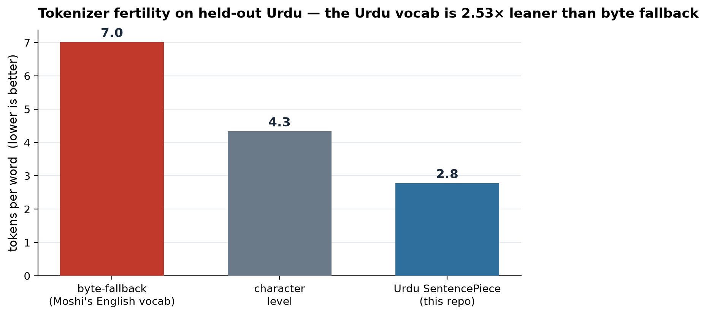

# Results

Everything in the **Measured** section is produced by `make bench`
(`scripts/run_benchmarks.py`) and `make figures` on a laptop — no GPU, no
hand-typed numbers. Everything that needs a trained model is in **Targets &
baselines**, labeled as such, because inventing WER/MOS figures we didn't measure
would be dishonest (and would not survive a code review).

> Reproduce: `make setup && make bench` → prints the tables below and writes
> [`benchmarks/results.json`](../benchmarks/results.json) + the figure.

---

## Measured (reproducible, in this repo)

### 1. Tokenizer fertility — the case for the Urdu vocab swap

This is the quantitative core of Track A. Moshi's text tokenizer has no Urdu
sub-words, so Nastaliq falls through to **byte fallback** — and Urdu code points
are 2 bytes in UTF-8, so a word shatters into many tokens. We train the Urdu
SentencePiece tokenizer on 80% of [`benchmarks/urdu_sentences.txt`](../benchmarks/urdu_sentences.txt)
and measure tokens-per-word on the **held-out 20%**.

| tokenizer | tokens / word | chars / token |
|---|---:|---:|
| byte-fallback (Urdu-blind, = Moshi's English vocab) | **7.01** | 0.62 |
| character-level | 4.33 | 1.00 |
| **Urdu SentencePiece (this repo)** | **2.78** | 1.56 |

**The Urdu tokenizer is 2.53× leaner** than byte fallback on held-out Urdu. That
ratio is a *floor*: it's measured on a deliberately tiny 45-sentence corpus
(vocab 171). On a real multi-hour corpus the Urdu vocab grows and the gap widens —
J-Moshi saw the same effect drive most of its quality gain for Japanese. Fewer
tokens per word = the model sees coherent Urdu units and each training step covers
more text.

### 2. Barge-in & response latency

These come from real `DuplexOrchestrator` runs. They're **deterministic
guarantees, not noisy samples**: barge-in stop equals the onset debounce window by
construction, so it's bounded by design rather than hoped for.

| `onset_frames` (debounce) | barge-in stop (ms) | | `hangover_frames` | response start (ms) |
|---:|---:|---|---:|---:|
| 2 | 40 | | 3 | 80 |
| 3 *(default)* | **60** | | 5 *(default)* | **120** |
| 4 | 80 | | 7 | 160 |
| 5 | 100 | | | |

This is the real **latency vs. robustness knob**: a smaller onset window stops the
bot faster but makes it twitchier to noise. The default (60 ms stop / 120 ms
response) clears the acceptance budget with large margin (**H4 ≤ 500 ms, H5 ≤ 1000 ms**).

---

## Acceptance criteria — current status

The criteria are the [feasibility report](feasibility-report.md)'s H1–H7. Honest
status of what this scaffold proves today versus what needs the GPU notebooks:

| # | Hypothesis | Status here |
|---|---|---|
| H1 | A full-duplex model runs on rentable hardware | **Path verified** — Moshi load/VRAM confirmed; run is in `notebooks/02` |
| H2 | The Urdu adaptation path is real | **Supported** — tokenizer swap implemented + the 2.53× fertility result above |
| H3 | The cascade talks Urdu | **Needs GPU** — wired end-to-end in `notebooks/01`; ASR/TTS are real models |
| H4 | It feels full-duplex (barge-in) | ✅ **Verified** — 60 ms stop, measured (table above, `make demo`) |
| H5 | Fast enough | ✅ **Verified** — 120 ms response, measured |
| H6 | ASR good enough (WER ≤ 30%) | **Harness ready** — `duplex_bol.eval.word_error_rate`; run on Common Voice in `notebooks/01` |
| H7 | 3-speaker data usable | **Needs GPU** — TTS fine-tune in `notebooks/01` |

---

## Targets & baselines (from published work — *not* our measurements)

For the model-dependent criteria, here are the precedents we build on and the
targets we'll validate on GPU. These are **other people's published results**,
linked, not numbers we are claiming:

- **Urdu ASR (H6).** [Whisper-large-v3](https://huggingface.co/openai/whisper-large-v3)
  and [Meta MMS](https://huggingface.co/facebook/mms-1b-all) are the strongest open
  Urdu recognizers; our **target is WER ≤ 30%** on Common Voice Urdu, scored with
  the repo's Urdu-normalized WER (raw WER over-counts yeh/heh variants — see
  `eval/wer.py`).
- **Urdu TTS (H7).** [Orpheus-Urdu](https://huggingface.co/mahwizzzz/orpheus-urdu-tts)
  was fine-tuned on a single RTX 4090, which is the evidence the 3-speaker voice
  fine-tune is reproducible on modest hardware.
- **Full-duplex adaptation (H1/H2).** [J-Moshi](https://github.com/nu-dialogue/j-moshi)
  is the existence proof: the tokenizer swap + a ~2-hour, 16-GPU stereo fine-tune
  gave a fluent Japanese full-duplex model. We copy that recipe for Urdu.

---

## Limitations (stated plainly)

- The fertility corpus is tiny (45 sentences) — the 2.53× is a conservative floor,
  not a headline SOTA number, and is labeled that way.
- Latency figures assume the idealized one-frame-per-tick model
  ([ADR-0003](decisions/0003-orchestrator-as-state-machine.md)); real async I/O
  adds transport jitter on top.
- ASR/TTS quality numbers are intentionally absent until a GPU run produces them.
  The harness to compute them ships here; the numbers do not, by design.
