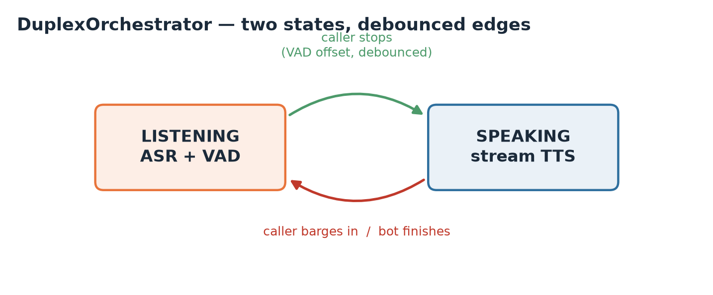

# Architecture

This document covers how the cascade (Track B) is put together and, in particular,
why the barge-in policy is a synchronous state machine. For the *why two tracks at
all* question, see the [feasibility report](feasibility-report.md) and
[ADR-0001](decisions/0001-two-track-strategy.md).

## The cascade, in one picture

Three model components in a line — ear, brain, mouth — plus a VAD whose only job is
to tell the orchestrator *"the caller is talking right now"*. The orchestrator is the
referee that turns four dumb parts into something that feels like a conversation.

## Components are Protocols, not classes

Everything the orchestrator talks to is a `typing.Protocol` (structural typing) in
[`cascade/interfaces.py`](../src/duplex_bol/cascade/interfaces.py):

| Protocol | Method(s) | Real implementation | Fake (for tests/demo) |
|---|---|---|---|
| `VoiceActivityDetector` | `is_speech(frame)` | `EnergyVAD`, later Silero | `EnergyVAD` (it's simple enough to be real) |
| `StreamingASR` | `reset / accept / finalize` | faster-whisper adapter | `ScriptedASR` |
| `AgentBrain` | `respond(text)` | an LLM client | `RuleBasedAgent` |
| `StreamingTTS` | `synthesize(text)` | Orpheus / SpeechT5 adapter | `ChunkedTTS` |

Because these are structural, a real adapter doesn't import or subclass anything from
this package — if it has the methods, it fits. That's the whole point: the
**orchestration policy is decoupled from the models**, so you can test the policy on
fakes and ship it on real components unchanged.

## Why the orchestrator is a synchronous state machine

A live voice agent is asynchronous and real-time: audio streams in continuously, the
bot streams audio out, and the two overlap. Written that way (threads, asyncio, audio
callbacks) the *policy* — when to start listening, when to stop talking — becomes
almost impossible to test, because it's tangled up with I/O timing.

So we separate them. [`DuplexOrchestrator`](../src/duplex_bol/cascade/orchestrator.py)
consumes an **iterable of audio frames** and yields **events**. No threads, no clocks
you can't control, no audio devices. It is a deterministic function of its input.

### The time model

One input frame = one tick. While the bot is speaking, each tick also *plays* one TTS
chunk, so input frames and output chunks share a fixed duration
(`frame_duration_ms`, default 20 ms). That 1:1 cadence is the simplification that buys
determinism. In production you wrap this loop in async I/O (Pipecat / LiveKit), but
the policy it encodes doesn't change.

### States and the transitions that matter

- **LISTENING** — feed speech frames to the ASR, emit partial transcripts. When the
  VAD confirms the caller stopped (offset), finalize, ask the brain, start the TTS.
- **SPEAKING** — emit one TTS chunk per tick *while still running the VAD on the
  input*. If the caller barges in (onset confirmed), kill the TTS immediately and go
  back to LISTENING. If the TTS runs out, the turn ended naturally.

### Debounce is not optional

Raw VAD output is twitchy — a cough, a door, a clipped consonant. If a single speech
frame could cancel the bot, the bot would stutter constantly. So
[`BargeInDetector`](../src/duplex_bol/cascade/orchestrator.py) sits between the VAD and
the policy and only reports a confirmed edge:

- **onset** after `onset_frames` consecutive speech frames (default 3 → ~60 ms),
- **offset** after `hangover_frames` consecutive silent frames (default 5 → ~100 ms).

The hangover also stops the agent from finalizing the instant you pause for breath.

### What it measures

Two latencies, recorded into a [`LatencyTracker`](../src/duplex_bol/eval/latency.py):

- **`barge_in_stop`** — from the first speech frame of the interrupting utterance to
  the tick the bot goes quiet. By construction this is the onset debounce window, so
  it's *bounded by design* (~60 ms with the defaults). Budget: ≤ 500 ms (H4).
- **`response_start`** — from the caller's last speech frame to the bot's first audio
  chunk. Covers the offset debounce plus brain + TTS spin-up. Budget: ≤ 1000 ms (H5).

Both fall straight out of the event stream. This timeline is rendered from a real run
(`scripts/make_figures.py`), not drawn by hand:

The `make demo` trace and the CLI's latency table come straight out of this.

## Events

The orchestrator yields a typed stream of events
(`CaptureStarted`, `PartialTranscript`, `UserUtterance`, `AgentReply`,
`SpeechStarted`, `SpeechEnded`, `BargeIn`). They serve three masters at once:
observability (log them), evaluation (the latencies ride on them), and tests (assert
the sequence). One representation, three uses.

## Wiring in real components

1. Implement the four Protocols around your models (a thin adapter each).
2. Replace `EnergyVAD` with a learned VAD for noisy phone audio.
3. Run the orchestrator's loop inside your async transport, mapping real audio frames
   to `AudioFrame` and TTS chunks back to the wire. `configs/cascade.yaml` records the
   component choices and the barge-in tuning to start from.

The policy code does not change. That's the payoff.

## Where Track A fits

Track A (Moshi) is a *different* answer to the same problem — one model that listens
and speaks at once, so there's no orchestrator to write. This repo's Track-A code is
the data and config plumbing to fine-tune it toward Urdu; see
[data engineering](data-engineering.md) and
[ADR-0002](decisions/0002-urdu-tokenizer-swap.md).
